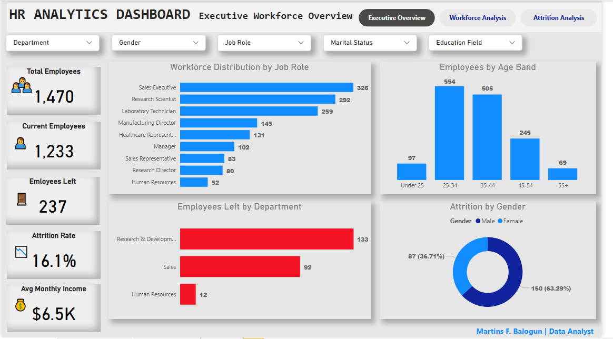
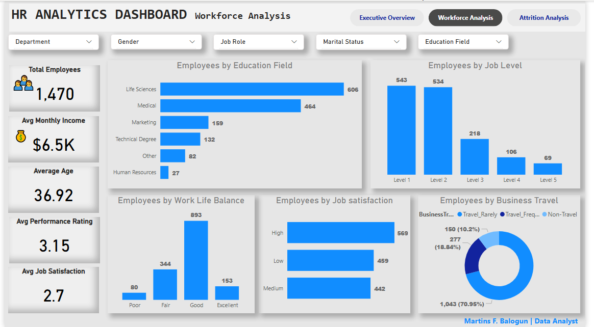
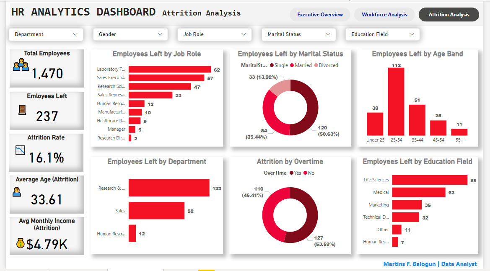

# HR Analytics Dashboard (Power BI)


## Dashboard Preview


## Executive Workforce Analytics Dashboard


## 📌 Project Overview

This project presents an interactive HR Analytics Dashboard developed in Microsoft Power BI to help HR professionals and business leaders monitor workforce performance, employee demographics, and attrition trends.

The dashboard transforms raw HR data into meaningful insights using interactive visualizations, KPI cards, slicers, custom DAX measures, and intuitive navigation. It supports data-driven decision-making by highlighting workforce composition, employee satisfaction, and key drivers of employee attrition.


## 🎯 Business Objectives

The primary objective of this project is to provide HR stakeholders with a centralized dashboard for monitoring workforce performance and employee retention.

The dashboard was designed to answer the following business questions:

- What is the current workforce size?
- Which departments have the highest employee attrition?
- Which job roles experience the highest employee turnover?
- How is the workforce distributed across age groups, education fields, and job levels?
- Does overtime appear to influence employee attrition?
- How do employee satisfaction and work-life balance vary across the organization?


## 📊 Dashboard Pages

### Executive Overview



### Workforce Analysis



### Attrition Analysis




### 1. Executive Overview

Provides a high-level summary of the organization's workforce through key performance indicators and employee distribution metrics.

**Key Metrics**
- Total Employees
- Current Employees
- Employees Left
- Attrition Rate
- Average Monthly Income

**Visualizations**
- Employees Left by Department
- Workforce Distribution by Job Role
- Employees by Age Band
- Attrition by Gender

---

### 2. Workforce Analysis

Explores employee demographics, organizational structure, and workforce characteristics.

**Key Metrics**
- Total Employees
- Average Monthly Income
- Average Age
- Average Performance Rating
- Average Job Satisfaction

**Visualizations**
- Employees by Education Field
- Employees by Job Level
- Business Travel Distribution
- Work-Life Balance Distribution
- Job Satisfaction Distribution

---

### 3. Attrition Analysis

Identifies employee turnover patterns and highlights the factors associated with attrition.

**Key Metrics**
- Total Employees
- Employees Left
- Attrition Rate
- Average Age (Employees Left)
- Average Monthly Income (Employees Left)

**Visualizations**
- Employees Left by Department
- Employees Left by Job Role
- Employees Left by Education Field
- Employees Left by Age Band
- Employees Left by Marital Status
- Employees Left by Overtime


## 📈 Key Insights

- The organization employs **1,470** people, with an overall **attrition rate of 16.1%**.
- **Research & Development** experienced the highest employee attrition.
- Employees aged **25–34** make up the largest workforce segment.
- **Sales Executives** and **Laboratory Technicians** recorded the highest number of employee exits.
- Employees who work **overtime** show significantly higher attrition than those who do not.
- Most employees report a **Good** work-life balance, indicating that attrition is likely influenced by additional factors.


## 🎯 Business Impact

This dashboard enables HR professionals to:

- Monitor workforce health through executive KPIs.
- Identify departments and job roles with high attrition.
- Understand workforce demographics and employee characteristics.
- Support data-driven decisions to improve employee retention.
- Enhance strategic workforce planning through interactive reporting.


## 🛠️ Tools & Technologies

- Microsoft Power BI Desktop
- Power Query
- DAX (Data Analysis Expressions)
- Data Modeling
- Data Visualization
- Microsoft Excel
- Git & GitHub


## 💡 Skills Demonstrated

- Data Cleaning and Transformation
- Data Modeling
- DAX Measure Development
- KPI Design
- Interactive Dashboard Design
- HR Analytics
- Business Intelligence Reporting
- Data Storytelling
- Dashboard Navigation
- Custom Tooltips
- Slicer Design


## 💡 Skills Demonstrated

- Data Cleaning and Transformation
- Data Modeling
- DAX Measure Development
- KPI Design
- Interactive Dashboard Design
- HR Analytics
- Business Intelligence Reporting
- Data Storytelling
- Dashboard Navigation
- Custom Tooltips
- Slicer Design

## ✨ Features

- Interactive slicers for dynamic filtering
- Executive KPI cards
- Three-page report navigation
- Custom DAX measures
- Interactive report tooltips
- Consistent dashboard theme
- Cross-filtering across visuals
- Business-focused HR insights


## 📁 Repository Structure

```
HR-Analytics-Dashboard/
│
├── Dashboard/
│   └── HR Analytics Dashboard.pbix
│
├── Dataset/
│   └── HR Dataset.xlsx
│
├── DAX Measures/
│   └── Measures.md
│
├── Images/
│   ├── dashboard-preview.png
│   ├── executive-overview.png
│   ├── workforce-analysis.png
│   └── attrition-analysis.png
│
├── README.md
├── LICENSE
└── .gitignore
```


## 🚀 How to Use

1. Clone this repository.
2. Open the `.pbix` file using Microsoft Power BI Desktop.
3. Refresh the data if required.
4. Explore the dashboard using the interactive slicers and navigation buttons.
5. Hover over visuals to view additional insights through custom tooltips.

## 🔮 Future Improvements

Future enhancements for this dashboard include:

- Department-level drill-through pages
- Advanced tooltip reports
- Employee retention forecasting
- AI-powered Key Influencers visual
- Mobile-optimized dashboard layout
- Row-Level Security (RLS) implementation


## 👨‍💻 About Me

**Martins F. Balogun**

Data Analyst | Business Intelligence Developer | Statistician

I enjoy transforming raw data into meaningful insights through interactive dashboards, business intelligence solutions, and data storytelling.


### Connect with me

- LinkedIn: https://www.linkedin.com/in/mfbalogun
- GitHub: https://github.com/bmartech
- Email: martinsfriday.mf@gmail.com


## 🙏 Acknowledgements

This project was developed for learning and portfolio purposes using the IBM HR Analytics Employee Attrition dataset.

Special thanks to the Power BI community for providing inspiration and best practices for dashboard design and data visualization.


## 📄 License

This project is licensed under the MIT License.

Feel free to use this project for learning and inspiration. If you find it helpful, please consider giving the repository a ⭐.